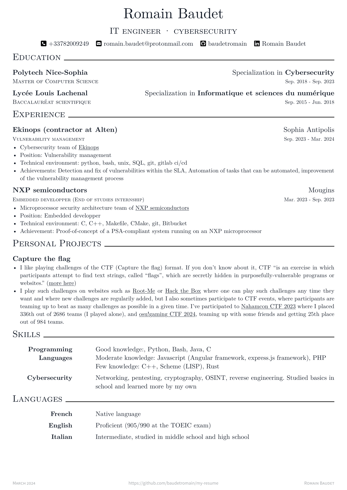
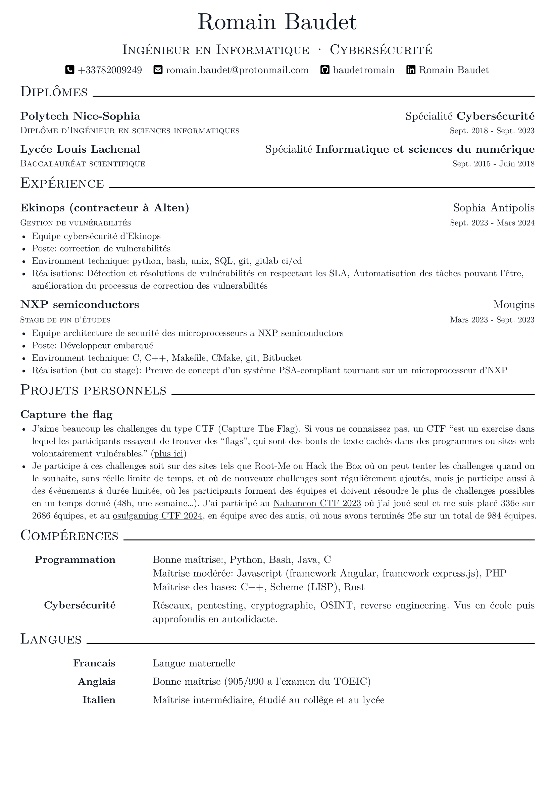

# My resume

This is my resume built with [typst.app](https://typst.app/).  
This is a fork of https://github.com/bamboovir/typst-resume-template.

## [Resume \[EN\]](./resume.pdf)



## [Resume \[FR\]](./resume.pdf)



## Development Environment

- Install [Typst](https://github.com/typst/typst)

- Install [Just](https://github.com/casey/just)

## Build Resume

```bash
just build
```

## Interactive Development Resume

```bash
just dev
```

## Containerized Build

```bash
just containerized-build
```

## Credit

[**Typst**](https://github.com/typst/typst) is a new markup-based typesetting system that is designed to be as powerful as LaTeX while being much easier to learn and use.

[**FontAwesome**](https://fontawesome.com/) is the Internet's icon library and toolkit, used by millions of designers, developers, and content creators.

[**Roboto**](https://github.com/google/roboto) is the default font on Android and ChromeOS, and the recommended font for Google’s visual language, Material Design.

[**Source Sans Pro**](https://github.com/adobe-fonts/source-sans-pro) is a set of OpenType fonts that have been designed to work well in user interface (UI) environments.
